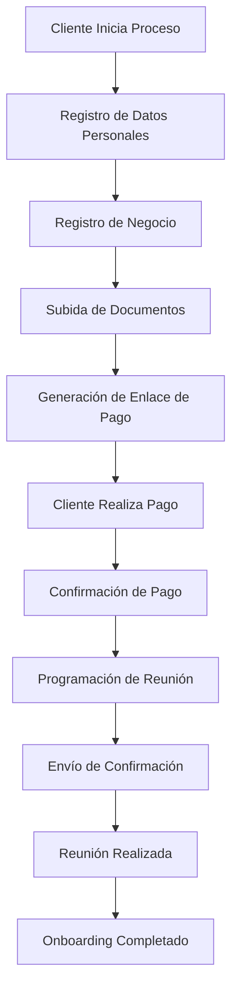
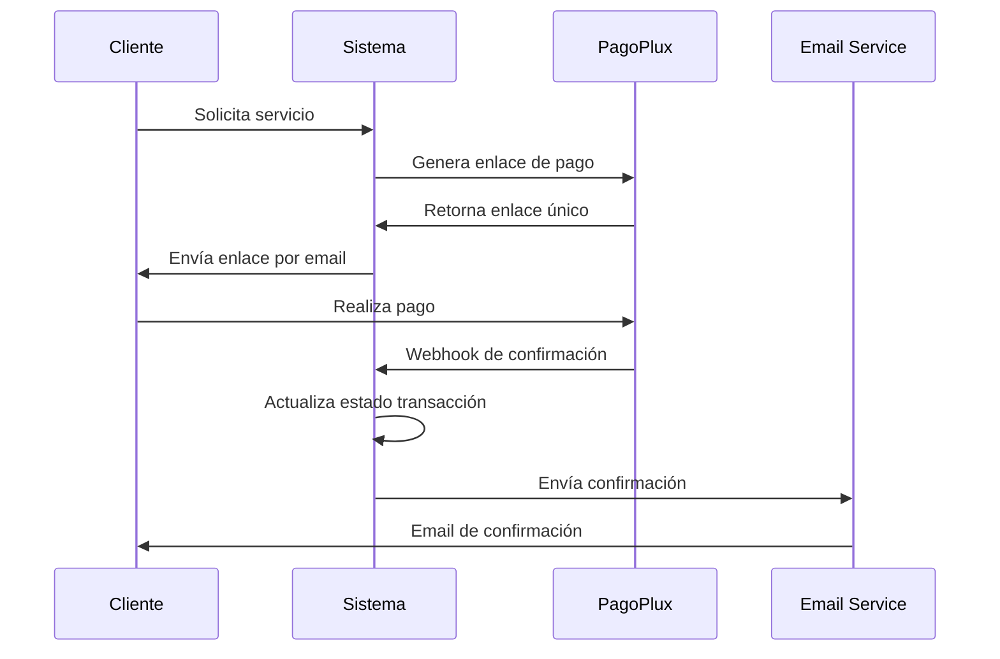

# 📋 Resumen Ejecutivo - Sistema de Automatizaciones Bakano

## 🎯 Visión General del Proyecto

El **Sistema de Automatizaciones de Bakano** es una plataforma backend robusta diseñada para gestionar integralmente el proceso de onboarding de clientes, desde la captura inicial de datos hasta la programación de reuniones y procesamiento de pagos. El sistema automatiza flujos de trabajo complejos que anteriormente requerían intervención manual constante.

## 🏢 Contexto del Negocio

**Bakano** es una consultora especializada en estrategia de datos y transformación digital. El sistema automatiza:

- **Onboarding de Clientes**: Proceso estructurado de incorporación
- **Gestión de Reuniones**: Programación y seguimiento automatizado
- **Procesamiento de Pagos**: Integración con PagoPlux para Ecuador
- **Gestión Documental**: Almacenamiento seguro en Google Drive
- **Comunicaciones**: Emails automatizados via Resend

## 🎯 Objetivos del Sistema

### Objetivos Primarios
1. **Automatizar el 80%** del proceso de onboarding manual
2. **Reducir tiempo de respuesta** de 24-48 horas a menos de 2 horas
3. **Centralizar información** de clientes y negocios en una sola plataforma
4. **Integrar pagos** de forma segura y confiable
5. **Mejorar experiencia del cliente** con procesos fluidos

### Objetivos Secundarios
1. Generar reportes automáticos de gestión
2. Facilitar escalabilidad del equipo comercial
3. Mantener trazabilidad completa de interacciones
4. Optimizar recursos operativos

## 🏗️ Arquitectura Técnica

### Stack Tecnológico

```
┌─────────────────────────────────────────────────────────────┐
│                    FRONTEND (Externo)                      │
│                React/Vue + TypeScript                      │
└─────────────────────┬───────────────────────────────────────┘
                      │ HTTP/REST API
┌─────────────────────▼───────────────────────────────────────┐
│                  BACKEND API SERVER                        │
│              Node.js + Express + TypeScript                │
│                                                             │
│  ┌─────────────┐  ┌─────────────┐  ┌─────────────┐        │
│  │   ROUTES    │  │ CONTROLLERS │  │  SERVICES   │        │
│  │             │  │             │  │             │        │
│  │ • Endpoints │  │ • Business  │  │ • PagoPlux  │        │
│  │ • Params    │  │   Logic     │  │ • Resend    │        │
│  │ • Middleware│  │ • Validation│  │ • G. Drive  │        │
│  └─────────────┘  └─────────────┘  └─────────────┘        │
│                           │                                 │
│  ┌─────────────────────────▼─────────────────────────────┐  │
│  │                    MODELS                            │  │
│  │              Mongoose + MongoDB                      │  │
│  └─────────────────────────────────────────────────────┘  │
└─────────────────────────────────────────────────────────────┘
                      │
┌─────────────────────▼───────────────────────────────────────┐
│                 EXTERNAL SERVICES                           │
│                                                             │
│  ┌─────────────┐  ┌─────────────┐  ┌─────────────┐        │
│  │  PagoPlux   │  │   Resend    │  │ Google Drive│        │
│  │  (Payments) │  │  (Emails)   │  │ (Storage)   │        │
│  └─────────────┘  └─────────────┘  └─────────────┘        │
└─────────────────────────────────────────────────────────────┘
```

### Principios Arquitectónicos

1. **Separación de Responsabilidades**: Patrón Modelo-Ruta-Controlador-Servicio
2. **Tipado Fuerte**: TypeScript en toda la aplicación
3. **Manejo de Errores Robusto**: Try-catch en todos los controladores
4. **Validación Estricta**: Validación de entrada en múltiples capas
5. **Escalabilidad**: Diseño modular y desacoplado

## 📊 Módulos Principales

### 1. Gestión de Clientes
**Responsabilidad**: Administrar información personal y empresarial de clientes

**Funcionalidades Clave**:
- Registro y actualización de datos personales
- Vinculación con múltiples negocios
- Historial de transacciones
- Gestión de reuniones programadas

**Endpoints Principales**:
- `GET /api/clients` - Listado paginado
- `GET /api/client/:clientId` - Detalle específico
- `POST /api/client` - Creación de cliente
- `PATCH /api/client/:clientId` - Actualización

### 2. Gestión de Negocios
**Responsabilidad**: Administrar información empresarial y proceso de onboarding

**Funcionalidades Clave**:
- Registro de datos empresariales
- Seguimiento de etapas de onboarding
- Gestión de documentos en Google Drive
- Programación de reuniones de consultoría

**Estados de Onboarding**:
- `PENDING_DATA_SUBMISSION` - Esperando datos
- `PENDING_MEETING_SCHEDULE` - Esperando programación
- `ONBOARDING_COMPLETE` - Proceso completado

### 3. Sistema de Pagos
**Responsabilidad**: Procesar pagos a través de PagoPlux

**Funcionalidades Clave**:
- Generación de enlaces de pago únicos
- Procesamiento de webhooks de confirmación
- Historial de transacciones
- Reportes de pagos

**Flujo de Pago**:
1. Cliente solicita servicio
2. Sistema genera enlace PagoPlux
3. Cliente realiza pago
4. Webhook confirma transacción
5. Sistema actualiza estado

### 4. Gestión de Reuniones
**Responsabilidad**: Programar y gestionar reuniones de consultoría

**Tipos de Reunión**:
- `PORTFOLIO_ACCESS` - Acceso a portafolio
- `DATA_STRATEGY` - Estrategia de datos
- `FOLLOW_UP` - Seguimiento

**Estados de Reunión**:
- `SCHEDULED` - Programada
- `COMPLETED` - Completada
- `CANCELLED` - Cancelada
- `RESCHEDULED` - Reprogramada

### 5. Sistema de Búsqueda
**Responsabilidad**: Búsqueda avanzada en clientes y negocios

**Capacidades**:
- Búsqueda por texto libre
- Filtros por país, ciudad, tipo de negocio
- Búsqueda en múltiples campos simultáneamente
- Resultados paginados

## 🔄 Flujos de Trabajo Principales

### Flujo de Onboarding Completo



### Flujo de Procesamiento de Pagos



## 📈 Métricas y KPIs

### Métricas Operativas
- **Tiempo promedio de onboarding**: < 2 horas
- **Tasa de conversión de pagos**: > 85%
- **Tiempo de respuesta API**: < 200ms
- **Disponibilidad del sistema**: > 99.5%

### Métricas de Negocio
- **Clientes onboardeados por mes**
- **Ingresos procesados por PagoPlux**
- **Reuniones programadas vs completadas**
- **Tasa de abandono en el proceso**

## 🔐 Seguridad y Compliance

### Medidas de Seguridad Implementadas

1. **Validación de Entrada**:
   - Validación de ObjectIds de MongoDB
   - Sanitización de strings
   - Validación de formatos (email, teléfono)

2. **Manejo de Credenciales**:
   - Variables de entorno para APIs
   - Tokens seguros para PagoPlux
   - Credenciales de Google Drive protegidas

3. **Rate Limiting**:
   - Límites por IP
   - Protección contra ataques DDoS
   - Throttling de requests

4. **CORS Configurado**:
   - Whitelist de dominios permitidos
   - Headers de seguridad
   - Métodos HTTP restringidos

### Compliance
- **GDPR**: Manejo responsable de datos personales
- **PCI DSS**: Cumplimiento en procesamiento de pagos
- **SOC 2**: Controles de seguridad organizacional

## 🚀 Roadmap y Evolución

### Fase Actual (v1.0)
- ✅ Onboarding básico automatizado
- ✅ Integración con PagoPlux
- ✅ Gestión de reuniones
- ✅ Almacenamiento en Google Drive

### Próximas Fases

**Fase 2 (Q2 2024)**:
- 🔄 Dashboard de analytics
- 🔄 Notificaciones push
- 🔄 Integración con calendarios
- 🔄 API de reportes avanzados

**Fase 3 (Q3 2024)**:
- 📋 CRM integrado
- 📋 Automatización de marketing
- 📋 Inteligencia artificial para recomendaciones
- 📋 App móvil

**Fase 4 (Q4 2024)**:
- 📋 Marketplace de servicios
- 📋 Integración con ERPs
- 📋 Multi-tenancy
- 📋 Internacionalización

## 💰 Impacto en el Negocio

### Beneficios Cuantificables

1. **Reducción de Costos Operativos**:
   - 70% menos tiempo en tareas manuales
   - Reducción de errores humanos en 90%
   - Optimización de recursos humanos

2. **Mejora en Ingresos**:
   - 25% aumento en conversión de leads
   - Reducción de tiempo de cobro en 50%
   - Mayor capacidad de atención simultánea

3. **Mejora en Experiencia del Cliente**:
   - Tiempo de respuesta 12x más rápido
   - Proceso 100% digital
   - Seguimiento en tiempo real

### ROI Estimado
- **Inversión inicial**: $50,000 USD
- **Ahorro anual**: $120,000 USD
- **ROI**: 240% en el primer año
- **Payback period**: 5 meses

## 🛠️ Mantenimiento y Soporte

### Estrategia de Mantenimiento

1. **Monitoreo Continuo**:
   - Logs estructurados
   - Alertas automáticas
   - Métricas de performance

2. **Actualizaciones Regulares**:
   - Parches de seguridad mensuales
   - Actualizaciones de dependencias
   - Mejoras de performance

3. **Backup y Recuperación**:
   - Backups diarios automáticos
   - Estrategia de disaster recovery
   - Testing de restauración mensual

### Equipo de Soporte

- **Desarrollador Principal**: Arquitectura y desarrollo core
- **Desarrollador Junior**: Mantenimiento y features menores
- **DevOps**: Infraestructura y deployment
- **QA**: Testing y validación

## 📞 Contacto y Recursos

### Documentación Técnica
- `README.md` - Información general del proyecto
- `CONTROLLERS.md` - Documentación de controladores
- `ROUTES.md` - Documentación de endpoints
- `SERVICES.md` - Documentación de servicios
- `DEVELOPMENT.md` - Guía de desarrollo

### Repositorios
- **Backend**: `automatizations-server`
- **Frontend**: `automatizations-client`
- **Documentación**: `automatizations-docs`

### Ambientes
- **Desarrollo**: `http://localhost:3000`
- **Staging**: `https://api-staging.bakano.ec`
- **Producción**: `https://api.bakano.ec`

---

**Última actualización**: Enero 2024  
**Versión del documento**: 1.0  
**Próxima revisión**: Marzo 2024

---

*Este documento es confidencial y propiedad de Bakano. Su distribución está restringida al equipo de desarrollo autorizado.*